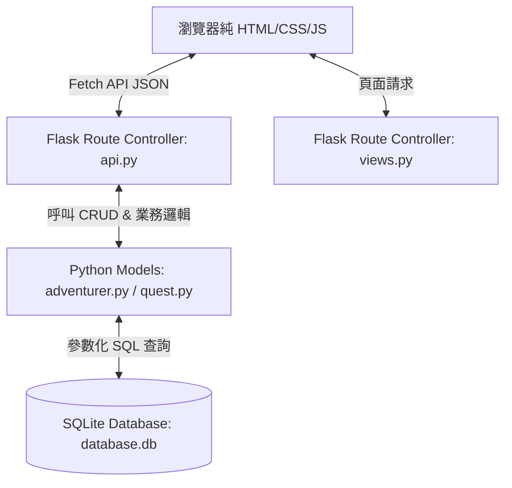

# 主線任務系統 系統架構設計

本文件說明「冒險者金庫」主線任務系統的技術選型、資料夾結構與元件交互關係。

## 1. 技術架構說明

系統採用經典的 **MVC (Model-View-Controller)** 模式進行架構：
- **Model (資料庫模型)**：位於 `app/models/`，使用 Python 原生 `sqlite3` 連線資料庫，實作防 SQL 注入的參數化查詢，封裝商業邏輯（例如獎勵發放、升級計算、任務解鎖判定）。
- **View (頁面與靜態檔案)**：位於 `app/templates/` 與 `app/static/`。使用純 HTML、CSS 與 JavaScript。HTML 定義架構，CSS 提供視覺美化，JavaScript (ES6+) 負責 DOM 操作、Fetch 非同步通訊與動畫渲染。
- **Controller (Flask 路由)**：位於 `app/routes/`，`views.py` 處理靜態頁面傳回，`api.py` 處理 API 請求（取得資料、表單提交驗證、結算）。



---

## 2. 專案資料夾結構

開發完成後，專案結構將如以下樹狀圖所示：

```text
c:/Users/User/Programming-Final-Report/
├── app/
│   ├── __init__.py           # Flask 應用程式初始化與資料庫關聯
│   ├── database.py           # SQLite 連線管理與初始化函式
│   ├── models/
│   │   ├── __init__.py
│   │   ├── adventurer.py     # 冒險者角色資料庫 CRUD 與獎勵計算邏輯
│   │   └── quest.py          # 主線任務、子目標與提交狀態處理邏輯
│   ├── routes/
│   │   ├── __init__.py
│   │   ├── api.py            # 任務操作、表單提交驗證、獎勵結算之 JSON API
│   │   └── views.py          # 網頁視圖路由（提供單頁/表單入口）
│   ├── static/
│   │   ├── css/
│   │   │   └── styles.css    # 奇幻暗黑冒險風格 CSS (磨砂玻璃、金色流光、動態效果)
│   │   └── js/
│   │       └── app.js        # API 請求、動態 DOM 渲染、粒子碰撞動畫引擎
│   └── templates/
│       └── index.html        # 主介面 HTML（看板、任務卡、彈出表單）
├── database/
│   └── schema.sql            # SQLite 建表腳本與初始主線任務資料
├── docs/
│   ├── PRD.md
│   ├── ARCHITECTURE.md
│   ├── FLOWCHART.md
│   ├── DB_DESIGN.md
│   └── ROUTES.md
├── instance/                 # Flask 實例目錄，存放資料庫
│   └── database.db           # 自動產生的 SQLite 資料庫
├── app.py                    # 專案啟動入口
├── README.md
└── requirements.txt          # 套件依賴
```

---

## 3. 關鍵設計決策

1. **單一資料庫連線上下文與 row_factory**
   - 每次請求都會透過 `get_db_connection()` 建立新連線，並使用 `sqlite3.Row` 以字典方式（欄位名稱）取值，提升程式碼可讀性。
   - 利用 Flask 的 `@app.teardown_appcontext` 確保請求結束時，資料庫連線一定會被自動關閉，防止資料庫鎖死（Database locked）。

2. **前後端非同步 Fetch API 串接**
   - 前端表單提交與任務接取一律使用 `fetch()` 進行非同步 POST 請求，後端回傳統一格式的 JSON 資料。
   - 這能讓使用者在點擊完成任務時，直接在原頁面以無重新載入（Seamless）的方式觸發炫目的經驗值條成長、金幣滾動與粒子煙火特效，極大提升使用者體驗。

3. **遊戲化升級與獎勵發放核心邏輯**
   - 冒險者升級公式為：當前經驗值大於等於 `等級 * 100` 時升級。
   - 當經驗值溢出時（例如 1 級，經驗值 90/100，完成任務獲得 150 EXP。總經驗值為 240），系統會正確進行多次升級，並保留餘額經驗值（例如升到 2 級需要 100，升到 3 級需要 200，溢出後角色會升到 3 級，經驗值剩下 40），確保數值精準無誤。
