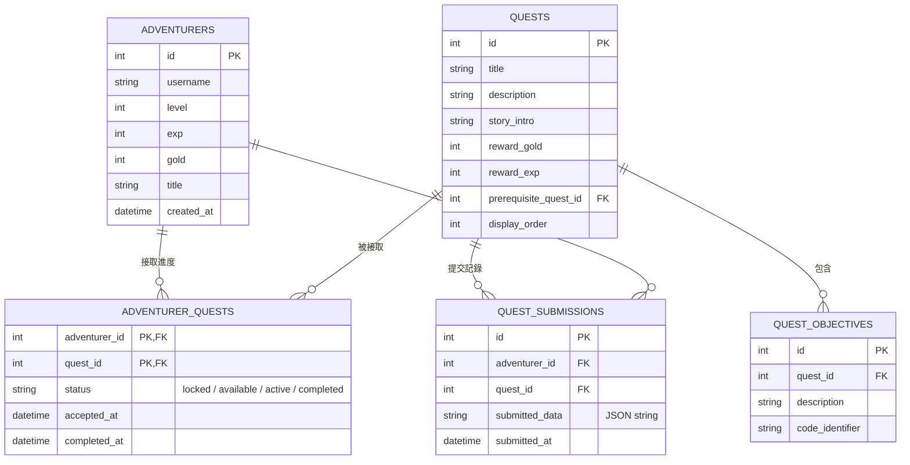

# 主線任務系統 資料庫設計 (DB Design)

本文件說明「冒險者金庫」主線任務系統的資料庫 Schema 與實體關係圖（ERD）。

## 1. 實體關係圖 (ERD)

使用 Mermaid `erDiagram` 表示冒險者、任務、子目標、使用者接取進度以及表單提交記錄之間的關係：

---

## 2. 資料表詳細說明

### 2.1 冒險者表 (`adventurers`)
儲存玩家角色屬性，用於累積獎勵與升級。
- `id` (INTEGER, PK, AUTOINCREMENT) - 冒險者唯一編號
- `username` (TEXT, 必填) - 冒險者帳號
- `level` (INTEGER, 預設 1) - 當前等級
- `exp` (INTEGER, 預設 0) - 當前經驗值
- `gold` (INTEGER, 預設 500) - 當前金幣數量
- `title` (TEXT, 預設 '見習冒險者') - 稱號
- `created_at` (TEXT, ISO8601 時間) - 創建時間

### 2.2 任務表 (`quests`)
儲存主線任務的基本定義與獎勵設定。
- `id` (INTEGER, PK, AUTOINCREMENT) - 任務唯一編號
- `title` (TEXT, 必填) - 任務標題
- `description` (TEXT) - 任務簡介與目標描述
- `story_intro` (TEXT) - 劇情式引言（渲染於表單上）
- `reward_gold` (INTEGER, 預設 0) - 獎勵金幣
- `reward_exp` (INTEGER, 預設 0) - 獎勵經驗值
- `prerequisite_quest_id` (INTEGER, 可空, FK) - 前置任務 ID，空值代表無前置條件即可接取
- `display_order` (INTEGER, 預設 0) - 展示順序

### 2.3 任務子目標表 (`quest_objectives`)
一個主線任務可能包含多個子目標（例如「開戶任務」需要同時設定名字、職業與密碼）。
- `id` (INTEGER, PK, AUTOINCREMENT) - 子目標唯一編號
- `quest_id` (INTEGER, FK, 必填) - 所屬任務 ID
- `description` (TEXT, 必填) - 目標文字描述（例如「設定金庫保險箱安全密碼」）
- `code_identifier` (TEXT, 必填) - 前端與後端對齊的欄位 ID（例如 `vault_password`）

### 2.4 冒險者任務進度表 (`adventurer_quests`)
多對多關係實體，紀錄每個冒險者接取每項任務的狀態。
- `adventurer_id` (INTEGER, PK, FK, 必填) - 冒險者 ID
- `quest_id` (INTEGER, PK, FK, 必填) - 任務 ID
- `status` (TEXT, 必填, 預設 'locked') - 狀態機選項：
  - `locked`：前置任務尚未完成，無法接取。
  - `available`：前置任務已完成，可點擊「簽訂契約/接取」
  - `active`：已接取，正在進行中，可填寫表單
  - `completed`：已提交並獲得獎勵
- `accepted_at` (TEXT, 可空) - 接取時間
- `completed_at` (TEXT, 可空) - 完成時間

### 2.5 任務表單提交記錄表 (`quest_submissions`)
儲存冒險者提交的表單詳細內容（JSON 格式），用於後端驗證與日後分析。
- `id` (INTEGER, PK, AUTOINCREMENT) - 提交編號
- `adventurer_id` (INTEGER, FK, 必填) - 提交者 ID
- `quest_id` (INTEGER, FK, 必填) - 任務 ID
- `submitted_data` (TEXT, 必填) - 表單資料的 JSON 字串（例如：姓名、保額等）
- `submitted_at` (TEXT, ISO8601 時間) - 提交時間
