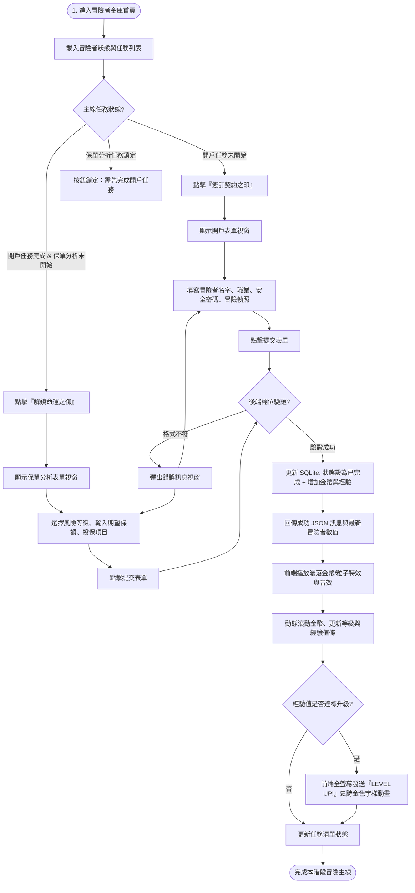
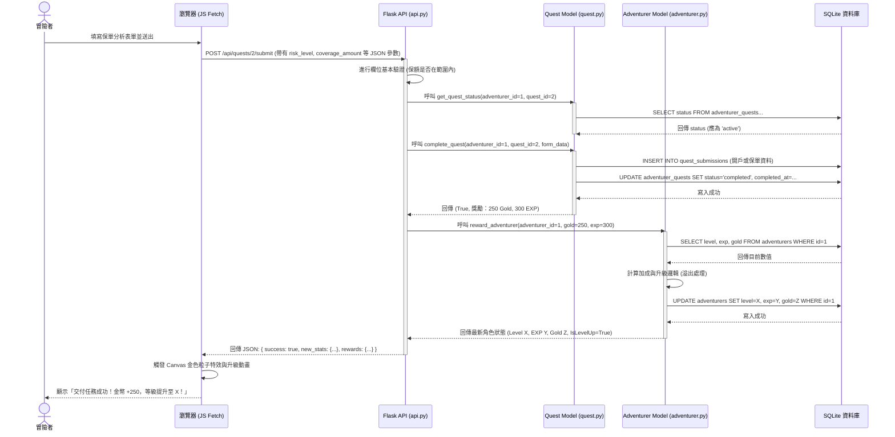

# 主線任務系統 流程與序列圖設計

本文件包含使用者操作的 Flowchart 以及前後端資料互動的 Sequence Diagram。

## 1. 使用者操作流程 (User Flow)

描述冒險者進入系統、接取任務、填寫並提交劇情表單、獲取獎勵的完整生命週期：

---

## 2. 系統序列圖 (Sequence Diagram)

以「保單分析任務」的提交為例，展示瀏覽器、Flask Route、Python Models 與 SQLite 的通訊：

---

## 3. 功能路由對照表 (Route Reference)

| 功能描述 | HTTP 方法 | URL 路徑 | 請求參數 (JSON) | 回傳內容 |
| :--- | :--- | :--- | :--- | :--- |
| 取得冒險者資訊 | GET | `/api/adventurer` | 無 | 冒險者當前等級、經驗、金幣 |
| 取得主線任務列表 | GET | `/api/quests` | 無 | 任務列表與接取狀態、子目標進度 |
| 簽訂契約（接取任務） | POST | `/api/quests/<id>/accept` | 無 | 任務狀態變更為 'active' 成功訊息 |
| 提交開戶任務表單 | POST | `/api/quests/1/submit` | `real_name`, `character_class`, `vault_password`, `license_number` | 獎勵結算、更新後數值 |
| 提交保單分析表單 | POST | `/api/quests/2/submit` | `risk_level`, `coverage_amount`, `insurance_types` | 獎勵結算、更新後數值、解鎖狀態 |
